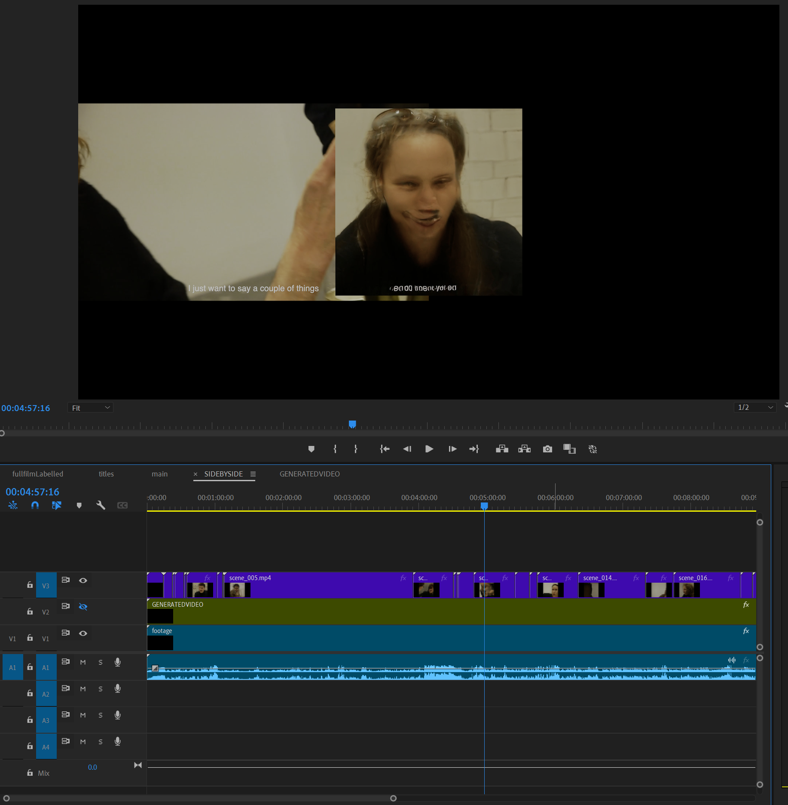

# StyleGAN3 Remake of *Who The Fuck Is Conor?*

Project Videos:
- [Side by side comparison with the original film](https://vimeo.com/962221187/9dc567cfb0?share=copy)
- [Generated video](https://vimeo.com/962159643/ce36485b86?share=copy)

The aim of this project was to experiment with ML video generation to create an interesting visual experiment, as well as to try my hand at algorithmic filmmaking for the first time. I just wanted to create a solidly watchable piece which is a bit more than a sketch, but I wasn't aiming for something polished necessarily!

## Original film description
I co-created *Who The Fuck Is Conor?* with my sister Anna Plowden in December 2021 for Rietveld TV, it was aired on Christmas Day that year on a local Amsterdam telly channel. 

"7/8 actors drunk on the telly.
After weeks of intensive personal interviews, role play and rehearsals a cast of actors were given a short script and a lot of wine and asked to grasp, vaguely, at why they are here."

The film process used roleplay and re-scripted improvised sections, and the actors are dressed uniformly, wearing fake stage mics. All of this makes it feel quite constructed and fake-but-real, which I think makes in an interesting candidate for this remake.

## Stages
### 00. Intro - Experimentation
Previously I had trained a DCGAN on the frames of this film but I was not particularly satisfied with the quality, so I was advised to move to StyleGAN. Earlier this term I had a job in India, where I was asked to pick up a football from a factory, and take some footage of the manufacturing process whilst I was there. I thought it could be interesting to train a GAN on this propietary footage, and potentially make a film from that. The resulting fake images looked like this:

However given the time constraints and my newness to these tools, I couldn't come up with an idea to do the footage justice. I think there is potentially some thematic interest because of the footage being propietary: perhaps something to do with the capitalist obscuration of manufacturing abroad, working conditions. Given more time and experience, I might return to this.

So instead, I decided to remake my previous film to have something more complete. The process is not wholly original and inspired by Terence Broad's Bladerunner Autoencoded, though I have used a GAN and projection instead of a VAE. 

Given that each frame projection takes such a long time it was unfeasible to project every frame and stick it back together, which I think could have been a more interesting effect, I opted to project every 25 frames (i.e. one every second) and interpolate between them. This created an issue I didn't foresee which I'll come back to.

### 01. Video Editing
1. Firstly, I had to crop the original film to the desired size 1024x1024px.
2. Separated the footage into title / credit sections to train two different models
3. Track the footage to follow the actors faces (I did this quite roughly in premiere pro)
- Now I extracted a large number of frames from these rendered videos for training.
1. I used Premiere Pro's cut detection to cut the footage into different shots (they're called 'scenes' in the code) and put them into the folder structure shown in [the noteboook](./vid_generator.ipynb).
2. I used the [extract_frames.py](./extract_frames.py) script to separate each shot into frames as shown also in the notebook.

### 02. Training
1. Quite simply I followed the [instructions on the StyleGAN3 repository](https://github.com/NVlabs/stylegan3/blob/main/docs/configs.md) for my particular setup and let it run. I managed to train for 380kimg for the main scenes and 60kimg for the title screens.
Here are the final resulting outputs from the models used in the film:

### 03. Projection
1. Detailed steps found in [the noteboook](./vid_generator.ipynb).
2. I looped through each of the shots and projected an image for each one, then interpolated between every second of generated frames to make back up the original runtime.

The issue that came up during this stage, is that the final extracted frame of each shot was never exactly on the 25th frame, therefore there was nothing for it to interpolate into. This means that we lost about 30 seconds of runtime, and the film would not sync up with the original.

To counter this, I adjusted the code for [extract_frames.py](./extract_frames.py) (see line 20 & 24-26) to also save the last frame. Then I regenerated these final two frames and redid the projection. As a result, you can notice that before every cut there is another cut, because the projected frames were not smoothly interpolated properly.

Unfortunately I didn't have time to run the whole thing again so I am left with this "off by one" manifestation. But I learned something!

### 04. Stitching it back together
1. Using openCV in the [vid_from_frames.py](./vid_from_frames.py) script I reconstructed every shot into its own video.
2. In Premiere Pro I manually dragged the files in and lined up the cuts, trimming the ends off of generated videos where they overun the original cut.
3. 

## Reflection
It was fun to try to think of an algorithmic kind of filmmaking, where once you press play, the film renders itself fully edited. I obviously didn't get it quite right with timings, and the projections. I would like to develop this more, and not even have to stitch the film back together manually at the end. But it was nonetheless an interesting experiment. 

The training stage worked out OK for the main section, the titles not so much. But I am sure there are further ways to chop up the data and make it looks better. It would be ideal to keep these things in mind during the filming process, and dedicating more time to editing the footage to be consumed by the network. I was actually surprised at how well it did considering.

Finally, and in a way most importantly, is it better than the original film? I definitely don't think so, but it was not conceived of in this way! I did ultimately achieve my goal of experimenting with algorithmic filmmaking and AI generated films!

## Workflow, other people's code and AI acknowledgements
I relied heavily on the Week 7 class Jupyter notebook called [02_StyleGAN_inference.ipynb](https://git.arts.ac.uk/rfiebrink/ExploringMachineIntelligence_Spring2024/blob/main/class-7/02_StyleGAN_inference.ipynb). I essentially wrapped the projection section from this file in a series of for loops. During the testing phase, where I was just working with 5-6 frames at a time, I was working directly in that notebook, so with the help of GitHub Copilot I put each sections from that section into its own loop. Then, since I wanted to create the whole film at a time, I manually wrapped those adapted sections in another greater for-loop, so that we could let it run overnight. I did this manually as I think the context window was a little too large for Copilot to get it right, and I really only had to copy/paste and change a couple of index variables etc. 

I also used the [utils.py file](https://git.arts.ac.uk/rfiebrink/ExploringMachineIntelligence_Spring2024/blob/main/class-7/utils.py) from the same class, which I suppose was written by a lecturer. I added my own wrapper function for `image_path_to_tensor()`, which was initially adapted from the Notebook by Copilot and which I then refactored into its own function `image_directory_to_tensors()`.

Finally I used Copilot to completely generate the scripts [extract_frames.py](./extract_frames.py) and [vid_from_frames.py](./vid_from_frames.py). These are truly just scripts which are a bit tedious to write and I find that Copilot does a fine job, after prompting a few times to clarify what I need.

I didn't use any AI to write the README explanations or the Jupyter notebooks comments / Markdown sections but some descriptions (about $w$ space) and the overall structure of the notebook are ripped directly from the [class notebook](https://git.arts.ac.uk/rfiebrink/ExploringMachineIntelligence_Spring2024/blob/main/class-7/02_StyleGAN_inference.ipynb).